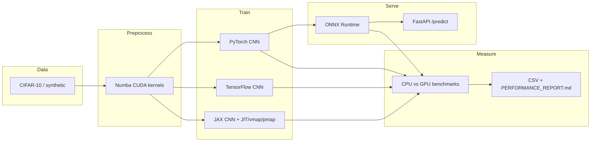

# GPU-Accelerated ML Pipeline

End-to-end **CIFAR-10** image classification that verifies five stack pieces in one repo:

| Skill | Where it lives | What you can show |
| --- | --- | --- |
| **CUDA** | `src/cuda_kernels.py` | Numba kernels for brightness + salt-and-pepper, DLPack interop with PyTorch |
| **JAX** | `src/jax_pipeline.py` | `jit` train step, `vmap` batching, `pmap` multi-device step, XLA matmul |
| **PyTorch** | `src/pytorch_model.py` | Residual CNN, CUDA training, checkpoints, GPU inference |
| **TensorFlow** | `src/tensorflow_model.py` | Keras residual CNN, GPU memory growth, train + predict |
| **ONNX** | `src/onnx_export.py` | PyTorch export, ONNX checker, ORT GPU / TensorRT EP |

The pipeline loads data, augments it on the GPU, trains the three framework models, exports ONNX, then writes **CPU vs GPU** latency, throughput, and memory to CSV + a markdown report.



---

## Quick start

### 1. Check the GPU

```bash
nvidia-smi
nvcc --version
python scripts/check_gpu.py
```

### 2. Create an environment (Python 3.10+)

```bash
python -m venv .venv
# Windows PowerShell
.venv\Scripts\Activate.ps1
# Linux / macOS
source .venv/bin/activate
```

Install **CUDA wheels first**, then the rest of the file:

```bash
pip install --upgrade pip

# PyTorch CUDA 11.8
pip install torch torchvision --index-url https://download.pytorch.org/whl/cu118

# JAX (Linux / WSL2). Pick one CUDA family:
pip install -U "jax[cuda12]"
# or CUDA 11: pip install "jax[cuda11_pip]" -f https://storage.googleapis.com/jax-releases/jax_cuda_releases.html

pip install -r requirements.txt
pip install -e .
```

> **Windows native:** PyTorch CUDA usually works. TensorFlow GPU and JAX GPU almost always need **WSL2** or **Docker**. The code falls back to CPU so the pipeline still runs; GPU numbers for TF/JAX will only show up in WSL2/Linux/Docker.

### 3. Run the full pipeline

```bash
python -m src --epochs 3 --batch-size 128 --max-samples 4000
```

Artifacts land in:

- `benchmark_results/results.csv`
- `benchmark_results/results.json`
- `benchmark_results/throughput.png`
- `benchmark_results/PERFORMANCE_REPORT.md`
- `checkpoints/` — PyTorch `.pt`, TensorFlow `.keras`, JAX `.npz`
- `models/cifar_cnn.onnx`

Fast dry run (no CIFAR download):

```bash
python -m src --synthetic --epochs 1 --max-samples 256 --benchmark-iterations 5 --warmup 1
```

CPU-only box:

```bash
python -m src --device cpu --frameworks pytorch onnx --synthetic --epochs 1
```

### 4. Tests

```bash
pytest tests -q
pytest tests/test_pipeline.py -m integration -q
```

### 5. Optional inference API

```bash
python -m src --frameworks pytorch onnx --epochs 2
uvicorn api.app:app --reload --port 8000
# POST /predict with an image file
```

---

## CLI

```
python -m src [options]
```

| Flag | Default | Meaning |
| --- | --- | --- |
| `--data-dir` | `./data` | torchvision CIFAR-10 cache |
| `--output-dir` | `./benchmark_results` | CSV, plots, report |
| `--epochs` | `3` | Train epochs per framework |
| `--batch-size` | `128` | Train + bench batch |
| `--max-samples` | `4000` | Train subset (full CIFAR-10 is 50k; keep small for demos) |
| `--frameworks` | `pytorch tensorflow jax onnx` | Stages to run |
| `--device` | `auto` | `auto` / `cpu` / `cuda` |
| `--brightness` | `1.15` | CUDA brightness factor |
| `--noise-prob` | `0.02` | Salt-and-pepper probability |
| `--skip-train` | off | Inference benches with random weights |
| `--synthetic` | off | Skip dataset download |
| `--log-level` | `INFO` | Logging verbosity |

---

## Project layout

```
.
├── src/
│   ├── cuda_kernels.py      # Numba CUDA brightness + salt-pepper + DLPack
│   ├── jax_pipeline.py      # JIT / vmap / pmap CNN
│   ├── pytorch_model.py     # Residual CNN, train, checkpoint, infer
│   ├── tensorflow_model.py  # Keras CNN, GPU growth, train, infer
│   ├── onnx_export.py       # Export, checker, ORT (CUDA / TensorRT EP)
│   ├── benchmark.py         # Timing, memory, CSV/JSON/plot
│   ├── pipeline.py          # argparse end-to-end CLI
│   ├── data.py              # CIFAR-10 or synthetic NHWC arrays
│   └── report.py            # PERFORMANCE_REPORT.md writer
├── api/app.py               # Optional FastAPI ONNX server
├── tests/                   # Unit + integration tests (CPU-safe)
├── notebooks/demo.ipynb
├── docker/                  # CUDA 11.8 image + compose
├── docs/LOOM_DEMO_SCRIPT.md
├── scripts/check_gpu.py
└── benchmark_results/
```

---

## What each stage does

### CUDA preprocessing

`brightness_kernel` multiplies every pixel by a factor and clamps to `1.0`. `salt_pepper_kernel` uses a cheap per-thread LCG so thousands of pixels update in one launch. PyTorch tensors move to CuPy through **DLPack** (zero-copy when both live on the same GPU). If Numba CUDA or CuPy is missing, the same math runs as vectorized PyTorch CUDA or NumPy so demos never hard-crash.

### JAX

- `loss_fn` + `jax.value_and_grad` inside a **`jit`** SGD step
- **`vmap`** over examples in `batched_forward`
- **`pmap`** with `pmean` for multi-GPU; a smoke step also runs on a **single** GPU (leading axis = 1)
- JIT `matmul` to show XLA kernels without handwritten CUDA

### PyTorch / TensorFlow

Matching compact residual CNNs (32 → 64 → 128 channels, global average pool, 10 logits). Default 3 epochs on a 4k-image subset is enough for a Loom run; pass `--max-samples 50000` for a serious training curve.

### ONNX + TensorRT

`torch.onnx.export` with dynamic batch, `onnx.checker`, then ONNX Runtime providers in order: **TensorRT → CUDA → CPU**. You get TensorRT acceleration when `onnxruntime-gpu` was built with the TensorRT EP and the library is on the machine — no extra C++ engine code required.

---

## Docker (best way to get all five GPUs working)

Requires [NVIDIA Container Toolkit](https://docs.nvidia.com/datacenter/cloud-native/container-toolkit/install-guide.html).

```bash
cd docker
docker compose build
docker compose run --rm pipeline --epochs 3 --max-samples 4000
docker compose --profile api up api
```

---

## Benchmarking metrics

The harness records, per framework and device:

- **Latency (ms)** after warmup (`cuda.synchronize` / `block_until_ready`)
- **Throughput (images/s)** = batch size / latency
- **Peak GPU memory (MB)** via `torch.cuda.max_memory_allocated`

`sample_results.csv` is an **illustrative** GPU box. Replace it with `results.csv` from your machine before you submit to REWORK — reviewers expect numbers that match your Loom video.

Typical patterns (not guarantees):

| Stage | What to look for |
| --- | --- |
| CUDA preprocess | Large GPU vs CPU throughput gap on a full batch |
| Training | GPU wall-clock per epoch 2–5× CPU on a mid-range NVIDIA GPU |
| Inference | ONNX Runtime / TensorRT often fastest serving path |
| JAX | First JIT call is slow (compile); timed loop is after warmup |

---

## Loom demo

Follow **[docs/LOOM_DEMO_SCRIPT.md](docs/LOOM_DEMO_SCRIPT.md)** (~8–12 minutes): `nvidia-smi`, kernel demo, train, ONNX, CSV speedup.

---

## REWORK evidence checklist

- [ ] Public GitHub repo with this README and runnable `python -m src`
- [ ] Loom: GPU visible, kernels, at least one training loop, ONNX session providers, benchmark table
- [ ] `benchmark_results/results.csv` **generated on your GPU** (not only the sample file)
- [ ] `benchmark_results/PERFORMANCE_REPORT.md` committed or attached
- [ ] Optional: FastAPI `/predict` screenshot or ngrok URL

---

## Troubleshooting

| Symptom | Fix |
| --- | --- |
| `torch.cuda.is_available() == False` | Install the cu118/cu121 wheel, not the CPU wheel; check driver with `nvidia-smi` |
| TensorFlow sees no GPU on Windows | Use WSL2 Ubuntu or Docker |
| JAX `backend=cpu` on Linux | Reinstall `jax[cuda12]` / `cuda11_pip` against the matching CUDA toolkit |
| OOM when running all three frameworks | `--frameworks pytorch onnx` first; we already set `XLA_PYTHON_CLIENT_PREALLOCATE=false` and TF memory growth |
| Numba `CudaSupportError` | Install a matching CuPy wheel (`cupy-cuda11x` or `cupy-cuda12x`) and a CUDA toolkit Numba can see |
| CIFAR download blocked | `--synthetic` |

---

## License

MIT. CIFAR-10 is loaded through torchvision and is used here for research/demo training only.
