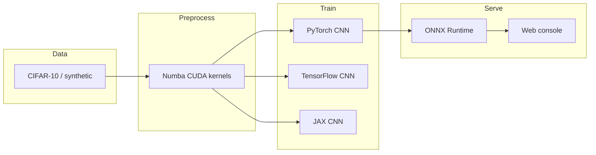

# GPU-Accelerated ML Pipeline

Train a CIFAR-10 image classifier, compare **CPU vs GPU** timing, export ONNX, and serve predictions — from a local web console or the CLI.

The same run exercises:

| Piece | Role |
| --- | --- |
| **CUDA** | Numba kernels for brightness + salt-and-pepper, DLPack interop with PyTorch |
| **JAX** | `jit` train step, `vmap` batching, `pmap` multi-device step |
| **PyTorch** | Residual CNN, CUDA training, checkpoints, GPU inference |
| **TensorFlow** | Keras residual CNN with GPU memory growth |
| **ONNX** | Export from PyTorch, then ONNX Runtime (TensorRT / CUDA / CPU) |



---

## Web console (recommended)

The console lets you pick **CPU / GPU / Auto**, start a run, watch logs, download CSV / markdown / PNG / zip, and classify an image.

```bash
Set-ExecutionPolicy -Scope Process -ExecutionPolicy Bypass
.\.venv\Scripts\Activate.ps1
python -m api
```

Then open **http://127.0.0.1:8000**

That page is the UI. `python -m src` only prints to the terminal — it does not open a browser.

First-time install (Python 3.10 or 3.11):

```powershell
py -3.11 -m venv .venv
.\.venv\Scripts\Activate.ps1
python -m pip install --upgrade pip
pip install torch torchvision --index-url https://download.pytorch.org/whl/cu118
pip install -r requirements.txt
pip install -e .
```

On Windows, `nvidia-smi` is often missing from PATH even when a GPU is installed:

```powershell
& "C:\Program Files\NVIDIA Corporation\NVSMI\nvidia-smi.exe"
python scripts/check_gpu.py
```

Native Windows: PyTorch CUDA usually works with a current Game Ready driver. TensorFlow GPU and JAX GPU typically need **WSL2** or **Docker**. The pipeline still runs on CPU if those backends stay on CPU.

---

## CLI

Same pipeline without the browser:

```bash
python -m src --epochs 3 --batch-size 128 --max-samples 4000
```

CPU-only smoke test:

```bash
python -m src --device cpu --frameworks pytorch onnx --synthetic --epochs 1 --max-samples 256 --benchmark-iterations 5 --warmup 1
```

GPU run:

```bash
python -m src --device cuda --epochs 3 --batch-size 128 --max-samples 4000
```

| Flag | Default | Meaning |
| --- | --- | --- |
| `--device` | `auto` | `auto` / `cpu` / `cuda` |
| `--frameworks` | `pytorch tensorflow jax onnx` | Stages to run |
| `--epochs` | `3` | Train epochs per framework |
| `--batch-size` | `128` | Train + bench batch |
| `--max-samples` | `4000` | Train subset (full CIFAR-10 is 50k) |
| `--synthetic` | off | Skip dataset download |
| `--skip-train` | off | Inference benches with random weights |

Artifacts:

- `benchmark_results/results.csv`
- `benchmark_results/results.json`
- `benchmark_results/throughput.png`
- `benchmark_results/PERFORMANCE_REPORT.md`
- `checkpoints/`
- `models/cifar_cnn.onnx`

---

## Tests

```bash
pytest tests -q
pytest tests/test_pipeline.py -m integration -q
```

---

## Docker

Needs the [NVIDIA Container Toolkit](https://docs.nvidia.com/datacenter/cloud-native/container-toolkit/install-guide.html).

```bash
cd docker
docker compose build
docker compose run --rm pipeline --epochs 3 --max-samples 4000
docker compose up console
```

Console: http://127.0.0.1:8000

---

## How the stages work

**CUDA preprocessing** — `brightness_kernel` multiplies pixels and clamps to `1.0`. `salt_pepper_kernel` uses a per-thread LCG. PyTorch tensors can move to CuPy through DLPack. If Numba CUDA is missing, the same math runs as PyTorch CUDA or NumPy.

**JAX** — `jit` SGD step, `vmap` over the batch, `pmap` + `pmean` for multi-GPU. The first JIT call is slow (compile); timed loops run after warmup.

**PyTorch / TensorFlow** — matching residual CNNs (32 → 64 → 128 channels, global average pool, 10 logits). Use `--max-samples 50000 --epochs 20` for a serious accuracy run. A 4k / 3-epoch job is for speed and wiring, not SOTA accuracy.

**ONNX** — `torch.onnx.export` with dynamic batch, then ONNX Runtime providers: TensorRT → CUDA → CPU.

---

## Benchmarks

The harness records latency (after warmup), throughput (`batch_size / latency`), and peak GPU memory. See [docs/PERFORMANCE_REPORT.md](docs/PERFORMANCE_REPORT.md).

`benchmark_results/sample_results.csv` is an example from a GPU box, not a substitute for numbers from your machine.

---

## Troubleshooting

| Symptom | Fix |
| --- | --- |
| `Activate.ps1` blocked | `Set-ExecutionPolicy -Scope Process -ExecutionPolicy Bypass` |
| `python` opens the Microsoft Store | Use `py -3.11` or the venv: `.\.venv\Scripts\python.exe` |
| `nvidia-smi` not recognized | Call the full path under `NVIDIA Corporation\NVSMI`, or add that folder to PATH |
| `torch.cuda.is_available() == False` | Install the cu118/cu121 wheel (not CPU), and a current NVIDIA driver |
| TensorFlow / JAX stay on CPU on Windows | Use WSL2 Ubuntu or Docker |
| CIFAR download blocked | `--synthetic` or the console checkbox |

---

## License

MIT. CIFAR-10 is loaded through torchvision for research and demo training.
